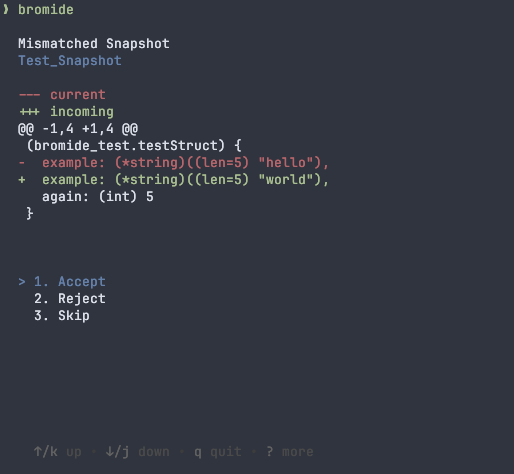

<div align="center">
<h1 align="center">bromide</h1>
 <strong>
  A snapshot testing library for go 📸
 </strong>
</div>

<br />

<div align="center">
 <br />
 
</div>


## Introduction

Bromide is a snapshot library for Go, designed to simplify managing snapshot tests. 

With Bromide, you can easily capture test output and then review any differences against expected values.

## Usage

### Write

```sh
go get github.com/cobbinma/bromide
```

```go
import github.com/cobbinma/bromide

func TestSomething(t *testing.T) {
    text := "world"
    something := testStruct{
      example: &text,
      again:   5,
    }
    
    bromide.Snapshot(t, something)
}
```

```
--- FAIL: Test_Snapshot (0.00s)
    bromide_test.go:24: snapshot mismatch
    bromide_test.go:24:
        --- current
        +++ incoming
        @@ -1,4 +1,4 @@
         (bromide_test.testStruct) {
        -  example: (*string)((len=5) "hello"),
        +  example: (*string)((len=5) "world"),
           again: (int) 5
         }


    bromide_test.go:24: to update snapshot run `bromide`
FAIL
FAIL    github.com/cobbinma/bromide     0.211s
FAIL
```

### Review

```sh
go install github.com/cobbinma/bromide/cmd/bromide@master
```


